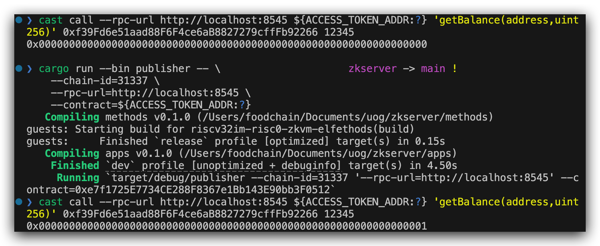

# zkServer

## Setting up

Before the zkServer is used, it has to be deployed. 

The ELF binary that represent the instructions inside `guest code` would be generated. And a unique identifier called `ImageId` would also be generated in the cargo building phase. `ImageId` represents guest code that zkServer uses, which means if anyone wants to generate a fake proof using another zkServer with the incorrect code, it will not pass the verification due to the incorrect `ImageId`.

## Structure


The current structure is based on `risc0-foundry-template`. However, we want to compile this into `wasm` and integrate with a `NEXTJS` web app.

---

## In the flow of ABE system

A zero knowledge virtual machine as the server to obtain:

1. attributes
2. tokenId (designed to be `keccak256(abi.encodePacked(address(do' address)))`)

This zkServer would then retrieve the `policy` from smart contract, check if the attributes satisfy the policy by traversing it.

Meanwhile, the `ct_cid` is going to be committed in the guest code (which is the code that would be proved).

If the check passes, zkServer would generate a proof, which is a receipt in RISC0 ZKVM. The receipt is composed of 2 parts: `seal` and `journal`. These two parts would both send into the smart contract. `seal`
Otherwise, the code would panic, and the proof would not be generated.

## Steps to execute this

### Running in local

Run a local blockchain environment using `anvil`.
 
```shell
                             _   _
                            (_) | |
      __ _   _ __   __   __  _  | |
     / _` | | '_ \  \ \ / / | | | |
    | (_| | | | | |  \ V /  | | | |
     \__,_| |_| |_|   \_/   |_| |_|

    0.2.0 (ef62fdb 2024-07-12T00:22:06.921038000Z)
    https://github.com/foundry-rs/foundry

Available Accounts
==================

(0) 0xf39Fd6e51aad88F6F4ce6aB8827279cffFb92266 (10000.000000000000000000 ETH)
(1) 0x70997970C51812dc3A010C7d01b50e0d17dc79C8 (10000.000000000000000000 ETH)
(2) 0x3C44CdDdB6a900fa2b585dd299e03d12FA4293BC (10000.000000000000000000 ETH)
(3) 0x90F79bf6EB2c4f870365E785982E1f101E93b906 (10000.000000000000000000 ETH)
(4) 0x15d34AAf54267DB7D7c367839AAf71A00a2C6A65 (10000.000000000000000000 ETH)
(5) 0x9965507D1a55bcC2695C58ba16FB37d819B0A4dc (10000.000000000000000000 ETH)
(6) 0x976EA74026E726554dB657fA54763abd0C3a0aa9 (10000.000000000000000000 ETH)
(7) 0x14dC79964da2C08b23698B3D3cc7Ca32193d9955 (10000.000000000000000000 ETH)
(8) 0x23618e81E3f5cdF7f54C3d65f7FBc0aBf5B21E8f (10000.000000000000000000 ETH)
(9) 0xa0Ee7A142d267C1f36714E4a8F75612F20a79720 (10000.000000000000000000 ETH)

Private Keys
==================

(0) 0xac0974bec39a17e36ba4a6b4d238ff944bacb478cbed5efcae784d7bf4f2ff80
(1) 0x59c6995e998f97a5a0044966f0945389dc9e86dae88c7a8412f4603b6b78690d
(2) 0x5de4111afa1a4b94908f83103eb1f1706367c2e68ca870fc3fb9a804cdab365a
(3) 0x7c852118294e51e653712a81e05800f419141751be58f605c371e15141b007a6
(4) 0x47e179ec197488593b187f80a00eb0da91f1b9d0b13f8733639f19c30a34926a
(5) 0x8b3a350cf5c34c9194ca85829a2df0ec3153be0318b5e2d3348e872092edffba
(6) 0x92db14e403b83dfe3df233f83dfa3a0d7096f21ca9b0d6d6b8d88b2b4ec1564e
(7) 0x4bbbf85ce3377467afe5d46f804f221813b2bb87f24d81f60f1fcdbf7cbf4356
(8) 0xdbda1821b80551c9d65939329250298aa3472ba22feea921c0cf5d620ea67b97
(9) 0x2a871d0798f97d79848a013d4936a73bf4cc922c825d33c1cf7073dff6d409c6

Wallet
==================
Mnemonic:          test test test test test test test test test test test junk
Derivation path:   m/44'/60'/0'/0/


Chain ID
==================

31337

Base Fee
==================

1000000000

Gas Limit
==================

30000000

Genesis Timestamp
==================

1723126111

Listening on 127.0.0.1:8545
```

Export the env variables:

```shell
ETH_WALLET_PRIVATE_KEY=0xac0974bec39a17e36ba4a6b4d238ff944bacb478cbed5efcae784d7bf4f2ff80 
export BONSAI_API_URL=https://api.bonsai.xyz/ 
export BONSAI_API_KEY=${YOUR_BONSAI_API_KEY}
```

Deploy the contract of `AccessToken`

```shell
forge script --rpc-url http://localhost:8545 --broadcast script/Deploy.s.sol
```

Export the contract as env variable:

```shell
export ACCESS_TOKEN_ADDR=${THE_ADDRESS_YOU_GET}
```

Read the tokenBalance from smart contract:

(currently the tokenId is hardcoded as `12345`, should be changed in the future)

```shell
cast call --rpc-url http://localhost:8545 ${ACCESS_TOKEN_ADDR:?} 'getBalance(address,uint256)' 0xf39Fd6e51aad88F6F4ce6aB8827279cffFb92266 12345
```

Execute the code by using:

This step includes:

* getting attributes and tokenId from data processor
* retrieve policy from smart contract
* check if attributes satisfy the policy
* make commitment and generating proof for data process
* send proof to mint the token (if verification passes)

```shell
cargo run --bin publisher -- \
    --chain-id=31337 \
    --rpc-url=http://localhost:8545 \
    --contract=${ACCESS_TOKEN_ADDR:?} \
```

And check the balance again:

```shell
cast call --rpc-url http://localhost:8545 ${ACCESS_TOKEN_ADDR:?} 'getBalance(address,uint256)' 0xf39Fd6e51aad88F6F4ce6aB8827279cffFb92266 12345
```

The result looks like:

